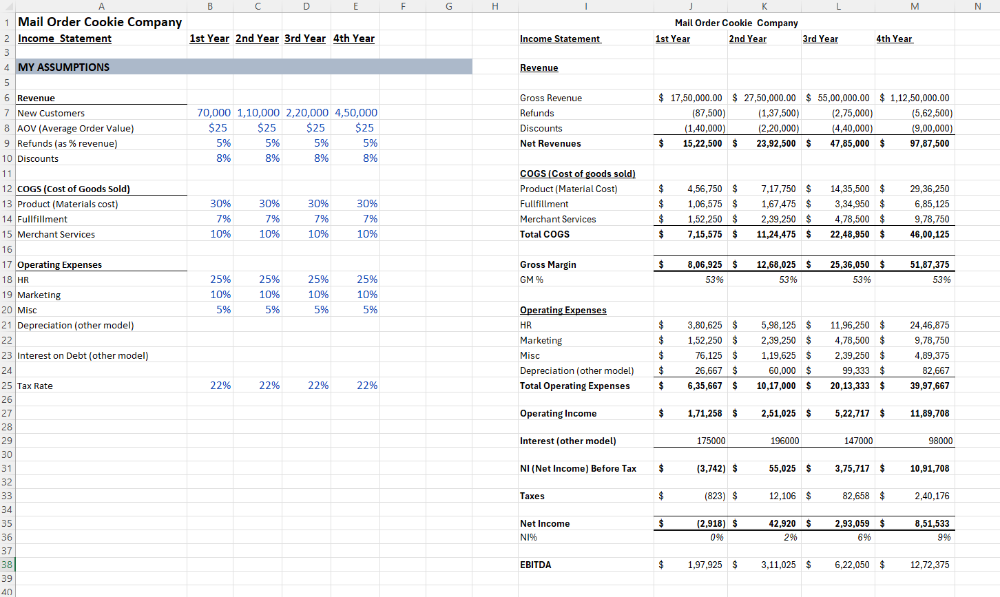
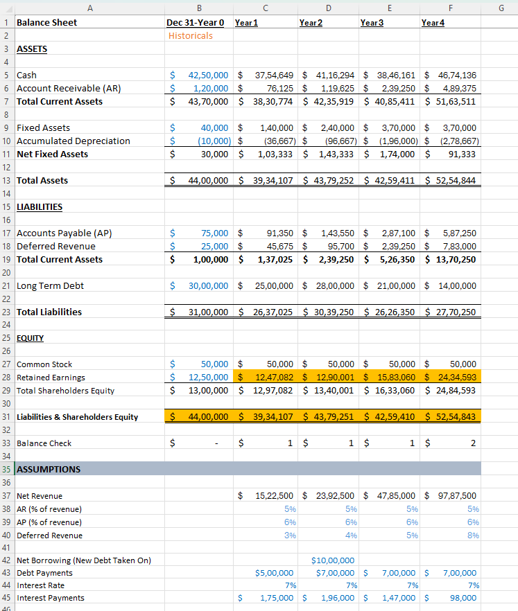
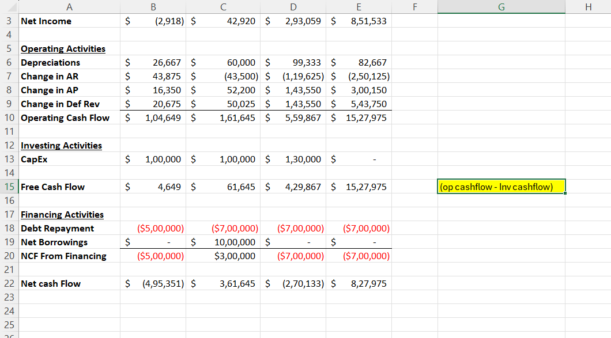
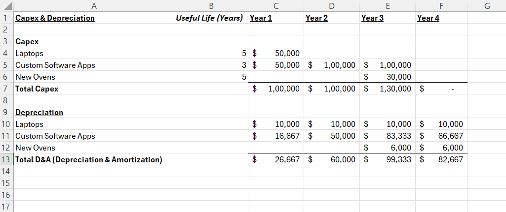

# Three-Statement Financial Model

## Overview

This project is a formula-driven three-statement financial model built in Microsoft Excel. The model integrates the Income Statement, Balance Sheet, and Cash Flow Statement using dynamic formulas and includes a Capital Expenditure & Depreciation Schedule. It was developed as a hands-on learning project to apply financial modeling concepts and understand the interrelationship between financial statements.

## Model Preview

### Income Statement

### Balance Sheet

### Cash Flow Statement

### Capital Expenditure & Depreciation Schedule

## Key Highlights

- Developed an integrated three-statement financial model in Microsoft Excel.
- Linked the Income Statement, Balance Sheet, and Cash Flow Statement using Excel formulas.
- Built a Capital Expenditure & Depreciation Schedule to support the financial model.
- Applied financial modeling concepts through a practical, hands-on project.
- Automated calculations to maintain consistency across all financial statements.

## Features

- Integrated Income Statement, Balance Sheet, and Cash Flow Statement
- Capital Expenditure & Depreciation Schedule
- Formula-driven calculations
- Dynamic statement linking
- Structured financial reporting

## Tools Used

- Microsoft Excel
- Financial Modeling
- Excel Formulas
- Cell Referencing

## Skills Demonstrated

- Financial Modeling
- Financial Statement Analysis
- Corporate Finance
- Microsoft Excel
- Formula-Based Automation
- Analytical Thinking
- Financial Reporting

## Files Included

- `Three-Statement Financial Model.xlsx` – Excel financial model
- `Income_Statement.png` – Income Statement preview
- `Balance_Sheet.png` – Balance Sheet preview
- `Cash_Flow_Statement.png` – Cash Flow Statement preview
- `Capex_Depreciation_Schedule.png` – Capital Expenditure & Depreciation Schedule preview
- `README.md` – Project documentation
## Author

**Preethi Rajendran**

Aspiring Financial Analyst | US CMA (Parts 1 & 2 cleared)
